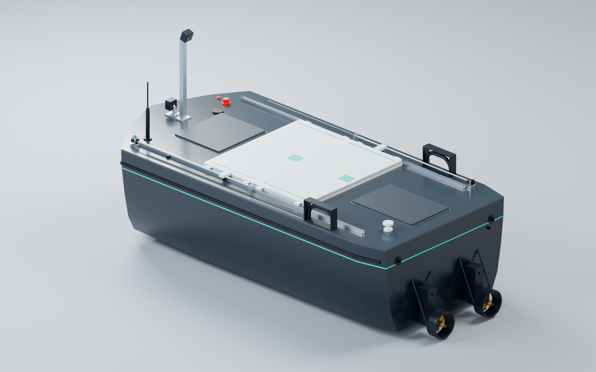
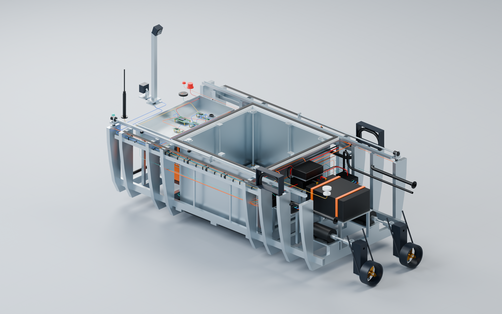
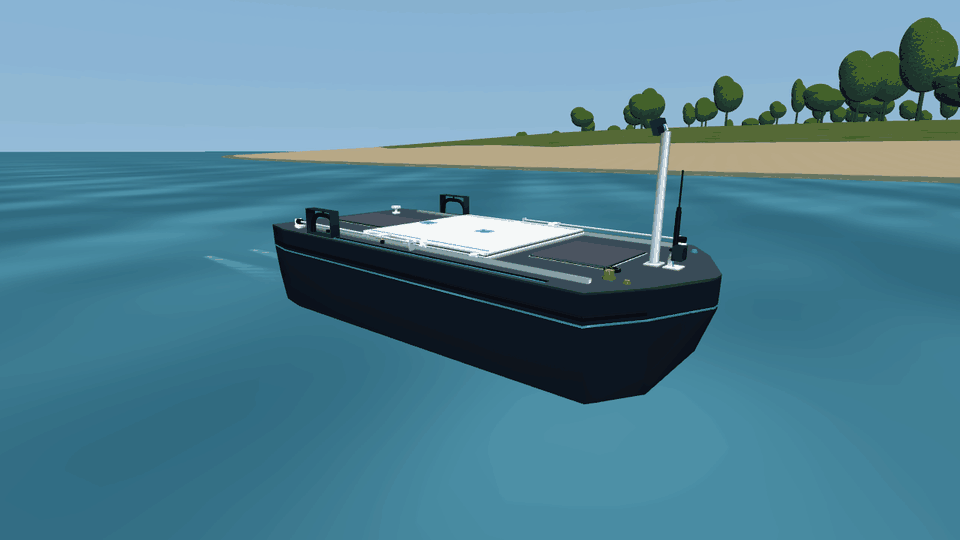
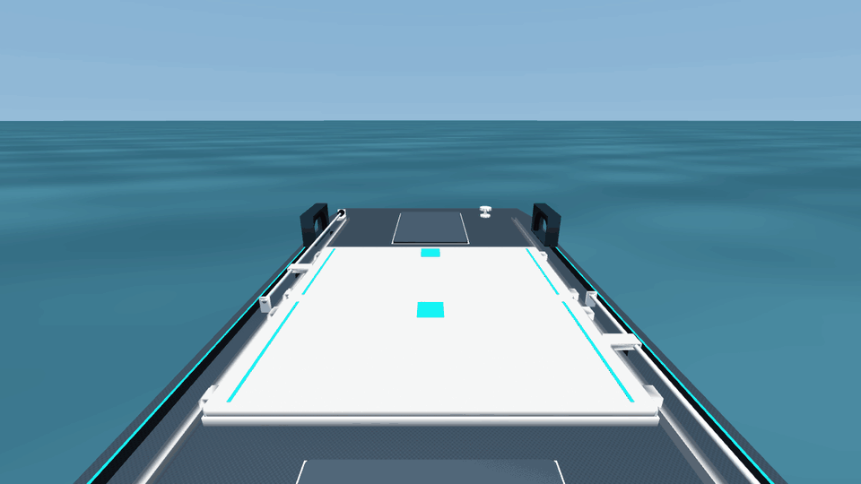

# AERODOCK

A drone-docking boat, designed in FreeCAD and brought into MuJoCo as a complete assembly. Its landing bay opens with two sliding lids, then a motor-driven platform lifts the landing pad above the deck.

| The boat | Under the deck |
|---|---|
|  |  |

The model includes the propulsion drives, batteries, wiring, drainage and onboard electronics, centred around a Khadas Edge 2 and SX1262 radio. Two mounted cameras cover the route ahead and the drone's landing area. The browser controls both motors independently, opens the bay, raises the platform and shows the camera feeds and speed.

## On the water

Full throttle along a wooded island, with 11 cm waves. Both motors stay at 100% throughout this straight coastal pass.



Opening the bay and raising the pad while the boat floats at rest, seen from the dock camera.



Buoyancy, propeller thrust and drag drive the boat's motion. Waves and currents affect its position and attitude; water entering the landing bay adds weight and triggers the drainage pumps. The water surface uses animated textures, while nearby terrain is loaded in chunks to keep rendering light. [Water model and assumptions](docs/physics_notes.md).

## Different places, different runs

The world generator creates wooded islands and sandy, urban, gravel or rocky coasts, with at least a kilometre of shoreline. Routes vary their distance from land, speed, coastal approaches and stretches on open water. Create a new world and route, keep the world and change the route, or take manual control.

Seeds let you repeat a run or generate variations for training. Episodes can also run without rendering and save their route and telemetry:

```powershell
python generate_episode.py --kind island --world-seed 42 --path-seed 43 --seconds 60 --output episodes/island_42_43
```

## Try it

With Python 3.11+ installed, double-click **Start_Boat.bat** and open **http://127.0.0.1:8765**. Keep the launch window open. To start from a terminal:

```powershell
python -m pip install -r requirements.txt
python server.py
```

Open the lids before raising the platform; lower it before closing them. You can still drive with the bay open and the platform raised.

Python control uses `BoatSim`; the running server exposes the same actions through its HTTP API at `/docs`. See [development and command reference](docs/development.md) for examples, checks and export tools.

The source is organised into `cad/` for the FreeCAD design, `models/` and `assets/` for the simulation assembly, `usv/` and `web/` for the application, and `tools/`, `tests/` and `reports/` for generation and verification.
