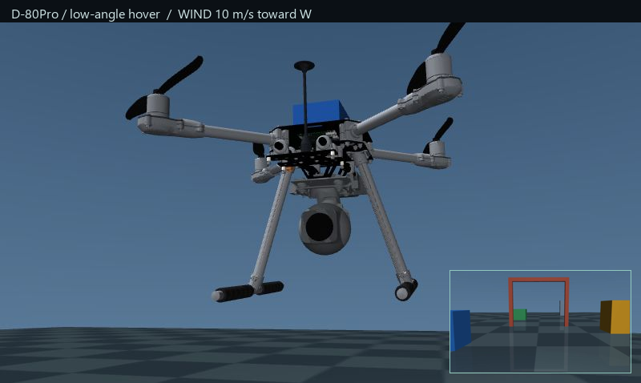
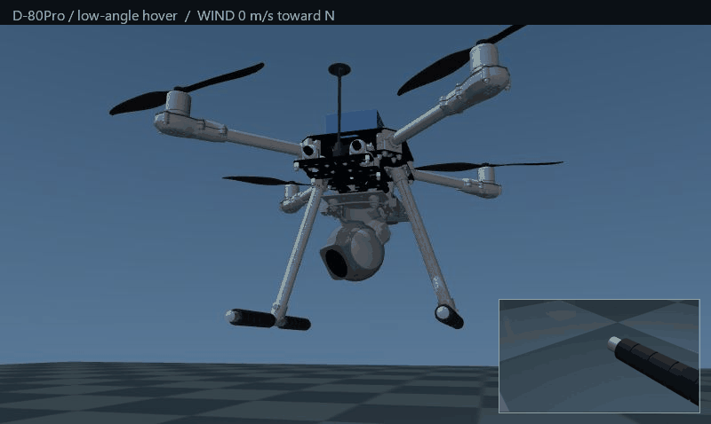
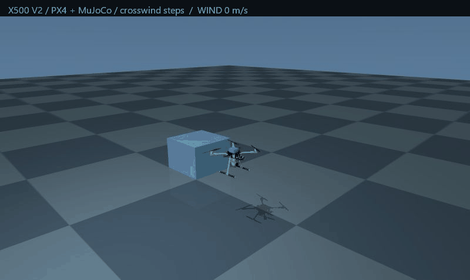

# PX4–MuJoCo Drone Simulation

A FreeCAD drone assembly brought into **MuJoCo + PX4 SITL**, with an articulated camera, real flight-control software and repeatable wind scenarios. Built for flight-and-camera experiments and an ML portfolio.



| D-80Pro close-up · hovering, from below | Wider flight · changing crosswind |
|:---:|:---:|
|  |  |

The close-up moves from calm to **10 m/s toward North, South, East and West**. The wider clip steps through **0 → 6 → 2 → 8 m/s**. Actual wind is shown in each frame.

**Live onboard video · continuous pan · bounded tilt · seeded gusts/turbulence · component collisions · propeller strikes · reset · mouse-wheel zoom**

## Parts & reference cost

| Component | Approx. EUR |
|---|---:|
| [Holybro X500 V2 / Pixhawk 6C kit](https://holybro.com/products/px4-development-kit-x500-v2), including motors, ESCs, propellers, GPS and telemetry | €544 |
| [ALLXF D-80Pro 40x-4K](https://allxf.com/product/d-80pro-40x-4k-spherical-gimbal-camera/) | €768 |
| [Khadas Edge2 Basic](https://www.soundimports.eu/en/khadas-keg2-b-001.html) | €240 |
| XIAO ESP32S3 + SX1262 · user price estimate | €9 |
| [Lumenier NAV 12000mAh 4S Amprius](https://www.lumenier.com/products/lumenier-nav-12000mah-4s-21700-amprius-lithium-ion-battery-xt60) | €195 |
| **Reference parts subtotal** | **~€1,756** |

Quotes checked 5 October 2026; maker prices converted to EUR, Edge2 quote includes VAT. Shipping, unspecified accessories, mounts and import charges are excluded. [Full sources and price basis →](docs/hardware.md)

The camera's third axis is locked in this CAD configuration. Pan is continuous; tilt is **−61° to +140°**. The model is **~2.066 kg**, with documented provisional mass distributions and aerodynamic coefficients—not a calibrated physical build. [Physics choices →](docs/environment.md)

## Run

Windows · Python 3.12 · WSL2 Ubuntu 22.04. [Build the pinned PX4 firmware once →](docs/setup.md)

```powershell
python -m pip install -e ".[build,test]"
python -m sim.server
```

Open **http://127.0.0.1:8793/** and press **Take off**.

**WASD** fly · **R/F** altitude · **Q/E** yaw · **arrows** camera · **Space** hover. Scroll over the flight scene to zoom; **Reset scene** restores the aircraft and restarts PX4.

## How it is built

1. `cad/` holds the original FreeCAD assembly; `tools/` audits its saved transforms, joint markers and mass geometry.
2. `models/` contains the articulated MJCF, render meshes, contact hull definitions and evidence metadata.
3. `sim/` exchanges sensors and motor commands with PX4; `web/` displays the flight scene, inspection view and camera feed. [Rebuild details →](docs/rebuild.md)

**LLM use:** LLMs assisted with CAD conversion, simulator code, source research and documentation; the supplied FreeCAD assembly provides the geometry, and MuJoCo/PX4 execute runtime physics and flight control without LLM calls.
